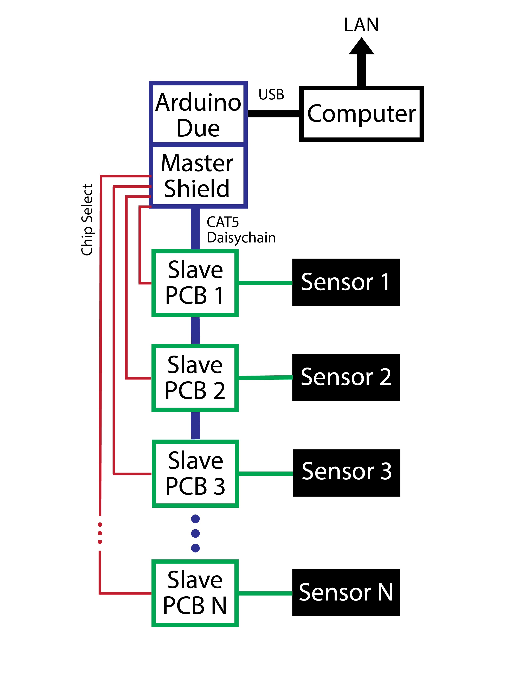

# What is this repository?
This repository contains all of the designs, code, and instructions needed to create a scalable tacile sensor reporting system capable of measuring up to eight 16x64 tactile sensor arrays at 80sps. This sensor system was designed with scale, speed, and cost in mind. The materials to create eight sensors costs less than $1000. However, the piezoresistive fabric used to make the sensors themselves is no longer made. That is a serious limiting factor for future use. Replacements such as [velostat](https://www.adafruit.com/product/1361) could be explored or a [custom](https://hackaday.io/project/168380-polysense) fabric could be made. The design of the system is rather technical, so this repository attempts to explain how the boards function and should be used. A high-level diagram of the sensing system is shown here:

# How is it organized?

This repository is a ROS package designed to be placed in a ROS workspace on the computer connected via USB to the Arduino Due. It can also be placed in the ROS workspace of a computer on the same network for debuging purposes. There are, however, several other directories not needed for a ROS package:

* **pcb_design** - this directory contains all of the wiring diagrams and PCB schematics. Information on purchasing the parts to populate the PCB's is also found here.
* **fabric_sensors** - this directory contains a tutorial on making a 16x64 fabric tactile sensor array along with Solidworks and DXF files used to make various sensors.
* **arduino** - this directory contains the instructions and code needed to test the PCB's and the main file for reporting tacitle data to a computer over USB.

# How do I get set up?

1. Order and populate a single master board. Use the tactile_sensor_master_v1.1_gerber.zip file to order the PCB from any repuable manufacturer and order all the parts listed in the **pcb_design** repository.

2. Order and populate however many slave sensor boards and add-on resistor boards needed (one each per 16x64 fabric sensor). Use tactile_sensor_slave_v2.1_gerber.zip and resitor_board_v1.0_gerber.zip files.

3. Make however many fabric tactile sensor grids you need using the tutorial found in the **fabric_sensors** directory.

4. Test all sensor boards and sensors using the testing scripts found in the **arduino** repository

5. Connect all of the slave boards to the master by first, daisychaining them together using Cat5 cable, and second, connecting each chip select pin indivitually from each slave to the master board.

6. Connect each sensor to its corresponding sensor slave board using the ribbon cables. The **fabric_sensors** repository outlines how these should be connected.

7. Make sure all settings on the board are correct. This includes termination resistors, ADC channel selection, power source selection, and CS dip switches.

8. Connect the Arduino Duo to power and a computer. The computer should be connected to the Due via its native USB port and not its programming port.

9. Run "roscore" on the master computer of your ROS network.

10. On the local computer (either directly or over SSH), launch the desired repeater launch file such as "roslaunch tactile_repeater.launch". The desired topics will now be published to on the ROS network.

11. Calibrate the sensors using the calibrate.py script in the **src/calibration** directory.

12. On any computer on the local ROS network, run "python3 tactile_plotter.py" when inside the **src** directory to plot a sensor's output. The topic that is being plotted can be changed using command line arguments like in this example where "python3 tactile_plotter.py right 3 large_1" will plot the data being published to topic /tactile/right/3 using the calibration file calibration_large_1.yaml.