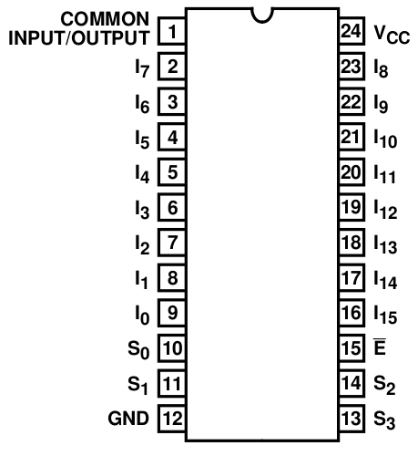
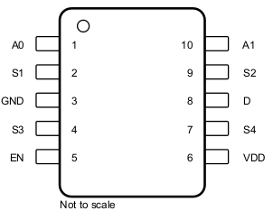
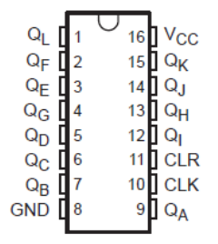
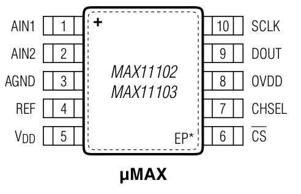

# Overview

This project was made by members of the Robotics and Dynamics Lab at Brigham Young University. This directory contains all of the necessary test and main scripts to be run on an Arduino Due for reading measurmetns from eight 16x64 tactile sensor arrays.

There are several testing scripts in this directory that are designed to test different components of the Tactile Sensor Slave Board as detailed in the pcb_design directory. A board does not need to be tested using these test scripts, however the testing scripts are designed to be easy to use. Once a board passes each testing script, it can then be tested as a full system using the main tactile_sensors_reporter script.

I suggest that the testing be done in the order in which this document is layed out.

# Counter Testing Script

Run this test first to ensure that all the outputs of the 12-bit binary counter are not shorted and the LED's work.
If you find that and LED is not lighting up, do not try to replace it. It is most likely that the LED is working, but
the signal from the clock is shorted somewhere. The most likely place that the clock output is shorted is at the solder
joints of the six MUX's. All it takes is one bad solder job to do this which could happen in any of the following three locations.

## Potentiometers

The first thing to check is that your count pin is terminated correctly. If the ethernet cable you are using is shorter than two feet, this will not be an issue. If it is longer than two feet, make sure that all the wires are terminated and that the potentiometers are set to 120-130 ohms. If the resistance is wrong, then some of the count signals could be ignored causing the counter to not make it all the way to 1023 before being rest. This will cause some of the row LED's to not light up or appear dim. The lack of light will start at R5, so you may see R5 not light up or R5 and R4 not light up, but this will never cause just R4 to not light up.

## 16-channel MUX Pinout

The most likely cause of a short on the 16-channel MUX is between GND and S1 or between E and S2. The E pin will always be grounded to enable the MUX, so either of these shorts will lead to an LED not turning on. If GND and S1 are shorted on the single row MUX, it will cause R1 to not light up. If E and S2 are shorted on the row MUX, it will cause R2 to not light up. If GND and S1 are shorted on any of the four 16-channel column MUX's, it will cause C3 to not light up. If E and S2 are shorted on any of the same MUX's, it will cause C4 to not light up. These shorts are by far the most common problems I found when debugging boards. Shorts between other pins can cause similar issues, but they are not as noticable (and thus need to be debugged later with the main script).

## 4-channel MUX Pinout

A short on the 4-channel mux is unlikely to be discovered in this test. It will most likely not cause an LED to not turn on just due to the pinout. However, it is always possible.

## 12-bit Binary Counter Pinout

A short on the binary counter is unlikely because of the large space between the pins, but it is always worth checking because any short will cause an LED to behave erratically.

## LED's

Finally, the LED that is not turning on could be the source of the short itself. Try replacing it.

# ADC Testing Script

After the counter is working properly, you can test the ADC. If the script is giving any output that you do not
expect, I would try to fix the soldering job of the chip. If needed, you can get a voltmeter and compare the output of the script to the reading on the voltmeter. It is likely that there is a short between two pins. Keep in mind that the problem could come from the large EP+ contact on the bottom of the chip not being properly grounded. Also remember that AIN1 and AIN2 may appear to be shorted because there is a trace that actually connects them. The same is true for VDD and REF. These shorts are meant to be there.

# Tactile Sensors Reporter

Now you need to test the full system to find small problems that could still exist. Follow the instructions in the main README to test a board. On the hardware side, the tactile_sensors_reporter.ino file should be uploaded to the master Arduino Due and the dip switches should be used to select which channels you would like to read. Any slave board that you wish to test should be daisy chained using ethernet cable and the SS/CS pins should be connected to the channels that were selected using the dip switches. You will be able to tell there is a soldering problem (or potentially a problem with the fabric sensor) if you press a taxel and it causes more than just one square to light up. This usually means a short between two pins of a MUX.

---