# Overview

This project was made by members of the Robotics and Dynamics Lab at Brigham Young University. This directory contains all of the necessary information needed to make any size of fabric tactile sensor array up to a size of 16x64. The process for making a sensor is not too complicated, but it is time consuming and monotonous.

# What do I need to make a sensor?

| Qty |  Cost  | Name                               | Description                                 | PURCHASE_URL |
|-----|--------|------------------------------------|---------------------------------------------|--------------|
| 1   | $15.99 | Spandex fabric                     | Extrerior fabric layer                      | [link](https://www.amazon.com/Activewear-Stretch-Spandex-Fabric-Swimsuits/dp/B09ZKCSN4V?source=ps-sl-shoppingads-lpcontext&ref_=fplfs&smid=A18QRZWQWFS2YY&th=1)           |
| 1   | NA     | Conductive fabric                  | Used as flexible conductive strips          | NA          |
| 1   | NA     | Resistive fabric                   | Headers needed to put the shield on the due | NA          |
| 80  | $0.08  | 7.5mm Metal Snaps                  | For connecting wires to conductive fabric   | [link](https://www.amazon.com/HEMOTON-Buttons-Fasteners-Clothes-Crafting/dp/B08JCVCD54/ref=sr_1_4?crid=8XIIG5MO2N4Y&keywords=Metal%2BRing%2BButtons%2BGrommets%2BSnap%2BFasteners%2BKit%2BPress%2BStuds%2BSnap%2BButtons%2BRings%2B%287.5mm%29&qid=1674253448&sprefix=metal%2Bring%2Bbuttons%2Bgrommets%2Bsnap%2Bfasteners%2Bkit%2Bpress%2Bstuds%2Bsnap%2Bbuttons%2Brings%2B7.5mm%2B%2Caps%2C512&sr=8-4&th=1)             |
| 1   | $6.98  | 10ft 16-wire Ribbon Cable          | For soldering to metal snaps                | [link](https://www.amazon.com/Connectors-Pro-16-pin-Conductor-Spacing/dp/B088M5KJ4F/ref=sr_1_4?crid=37GL5OH95IQKI&keywords=16%20wire%20ribbon%20cable&qid=1674253722&sprefix=16%20wire%20ribbon%20cab%2Caps%2C216&sr=8-4)             |
| 5   | $0.35  | 2x8 Female Header for Ribbon Cable | For connecting ribbon cable to board        | [link](https://www.amazon.com/Tegg-FC-16P-Connector-Rectangular-Adapter/dp/B07SNSFZ7H/ref=sr_1_1_sspa?content-id=amzn1.sym.9575273b-ecd8-4648-9bf0-15f20c657e0a&keywords=idc%20cable%20connector&pd_rd_r=bbdda0ed-bc37-4af3-b1c5-5ee5878da35d&pd_rd_w=d8bZV&pd_rd_wg=zjBOo&pf_rd_p=9575273b-ecd8-4648-9bf0-15f20c657e0a&pf_rd_r=5250M3BRJ0XT5ASGNJQ6&qid=1674257613&sr=8-1-spons&psc=1&spLa=ZW5jcnlwdGVkUXVhbGlmaWVyPUE1VlE1NUpPRlUwSVQmZW5jcnlwdGVkSWQ9QTAyMDU2ODkyQlA4Tk4xT0tJRjMyJmVuY3J5cHRlZEFkSWQ9QTA1OTQwMzMySlM5UzJFRk5HTE9WJndpZGdldE5hbWU9c3BfYXRmJmFjdGlvbj1jbGlja1JlZGlyZWN0JmRvTm90TG9nQ2xpY2s9dHJ1ZQ%3D%3D)           |

NOTE: the ammount of fabric and ribbon cable may vary. For a standard-sized sensor, the known price is about $30 (parts plus shipping and tax). This does not include the price for the conductive fabric and resistive fabric which was purchased before this project started but is estimated to be an additional $30 to $50.

# How do I make a sensor?

1. Lay out your sensor either on paper or in a CAD program. You will eventually need a CAD program to produce the files for laser-cutting the conductive strips. Your layout should look something like this:

    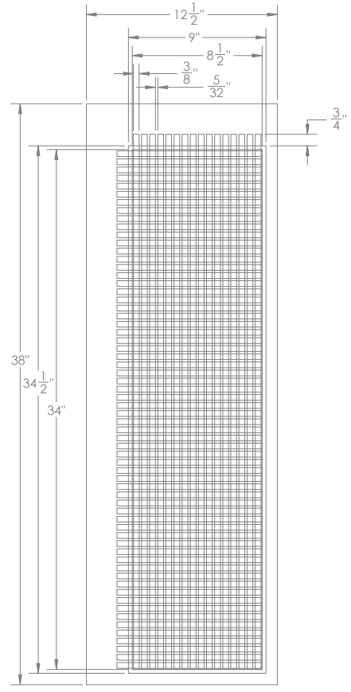

    The sensor depicted above has a sensing area of 8.5" by 34" (a 1 to 4 ratio). The rest of the dimentions are based on that. The rectangle that is 9" by 34.5" is the size that the resistive fabric will be cut to. This gives a quarter inch error buffer on every edge. The largest outer rectangle is the size of the spandex fabric that will be placed on the outer-most surfaces of the sensor. There is a one inch buffer given on the edges where there will be no wires and a three inch buffer on the edges where wires will run. This is to allow space for the ribbon cable and sufficient surface area for glue. These edges can be trimmed down at the end of the build. Choose a conductive strip width and spacing that will give approximately 16 rows and 64 columns. The small leftover space can be placed on the edges of the sensing area. In this case, the conductive strips are 3/8" wide and there is a 5/32" gap between them. The strips extend 3/4" past the sensing area so that a metal snap can be attached and a wire soldered to each snap. A little more care needs be taken to produce a non-rectangular design, but it can be done. Some trapezoidal designs, for example have been made.

2. Cut the resistive fabric and two copies of the spandex exterior fabric as designed in the previous step. If there are large wrinkles in the fabric, iron it before cutting it to ensure that the shape is correct. If you did not iron the fabric before cutting it, make sure to iron it afterwards before moving onto the next steps.

3. Laser-cut the conductive strips (according to the design from step 1) that will be glued to the spandex. There should be 16 long strips cut for the rows and 64 shorter strips cut for the columns. The strips should be 3/4" longer than the sensing dimention to make room for the snap and wire. I found that this step of the process was the one most prone to problems. Most laser cutters blow air at the cutting surface to clear lingering smoke. This will blow the fabric around and ruin it if proper precautions are not taken. To solve this, there are a few things you should do. Insead of trying to cut the strips out entirely, only make the long cuts with the laser cutter. After the long cuts are done, manually cut the strips to length. Also, soak the fabric in water before cutting it to make it heavier, stickier, and less likely to blow around. Cut the fabric horizontally, starting at the back and going to the front. The air will then blow the cut fabric around a bit, but leave the fabric that is yet to be cut unmoved. Once the cuts are done, rinse the fabric again in water and hang it to dry. Once it is dry, manually cut the strips to the correct length. The image below is of a DXF used for laser cutting the columns. Notice that there are no cuts for the short end of the strips, just lots of horizontal cuts of length slightly longer than needed (10") spaced 3/8" apart. Also note that the direction that the conductive fabric is cut does matter. The fabric has the tendency to curl in one direction. Thus, if it is cut in the incorrect orientation, the strips will curl up and turn into tubes. These are much harder to deal with than if the tips of each strip has a little bend in it.
    
    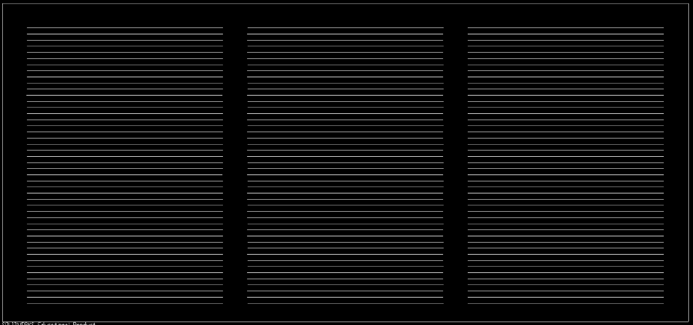

4. Glue the conductive row and column strips to the spandex exterior sheets. Remember that one of these sheets will need to be upside down and facing the other, so ensure that the location which you glue the strips is correct. To ensure that the strips are spaced correctly, print out rulers that have the spacing on them (include the strip widths and spacing). For long dimensions, you will need to tape or glue the pieces of paper together. Place a paper ruler on either side of the area where you will glue the cunductive fabric strips down to act as rulers. An example paper ruler is shown below.

    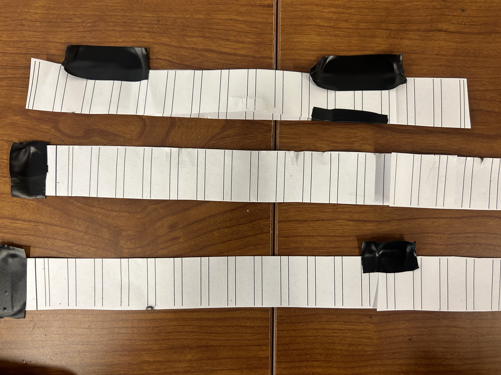

    Use a straight edge to make a line between the two paper rulers. Place a line of glue along the edge near where the center of the strip will lie. Place the strip along the straight edge and on top of the glue. If needed, stretch the strip out to make sure it covers the area between both rulers. If it is a little long, it can be snipped after the glue dries. Once the strip is in place, use a long block of wood or other rectangular object to push down on the strip evenly. It does not need to be as long as the strip, but you should apply pressure to the whole strip in segments. Use Aleene's Fabric Fusion glue found [here](https://www.amazon.com/Aleenes-Fabric-Fusion-Permanent-Adhesive/dp/B00178QSE6/ref=asc_df_B00178QSE6/?tag=hyprod-20&linkCode=df0&hvadid=309807964063&hvpos=&hvnetw=g&hvrand=8926381093032493341&hvpone=&hvptwo=&hvqmt=&hvdev=c&hvdvcmdl=&hvlocint=&hvlocphy=1026980&hvtargid=pla-392595793636&psc=1) to glue all parts of the sensor. The glue is also availabe at JOANN in Provo which is where we bought it. A sensor should take at most 4 fluid ounces of glue, but less than 2 fluid ounces is ideal. View videos timelapse_glue_columns.MOV and timelapse_glue_rows.MOV in the resource directory to see what this process looks like. Below is an image of what the sensor should look like when it is done.

    

5. Press a metal snap into each conductive row and column. This is done by taking the metal snap piece with the spikes and sticking the spikes through the spandex side of the sensor and then through the conductive strip so that the spikes are visible sticking up through the strip. Place the other metal snap piece on top of it and hit it with a mallet softly, make sure that the two halves haven't slipped off of each other, meaning they are aligned. Then proceed to hit it hard a few times so that the snap is secured. This process is shown in the attach_metal_snap.MOV video file in the resources directory and in the below images.

    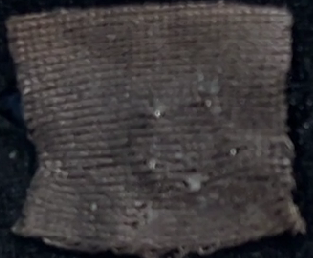
    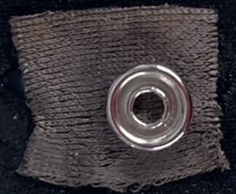

    A finished half of a sensor looks like this:

    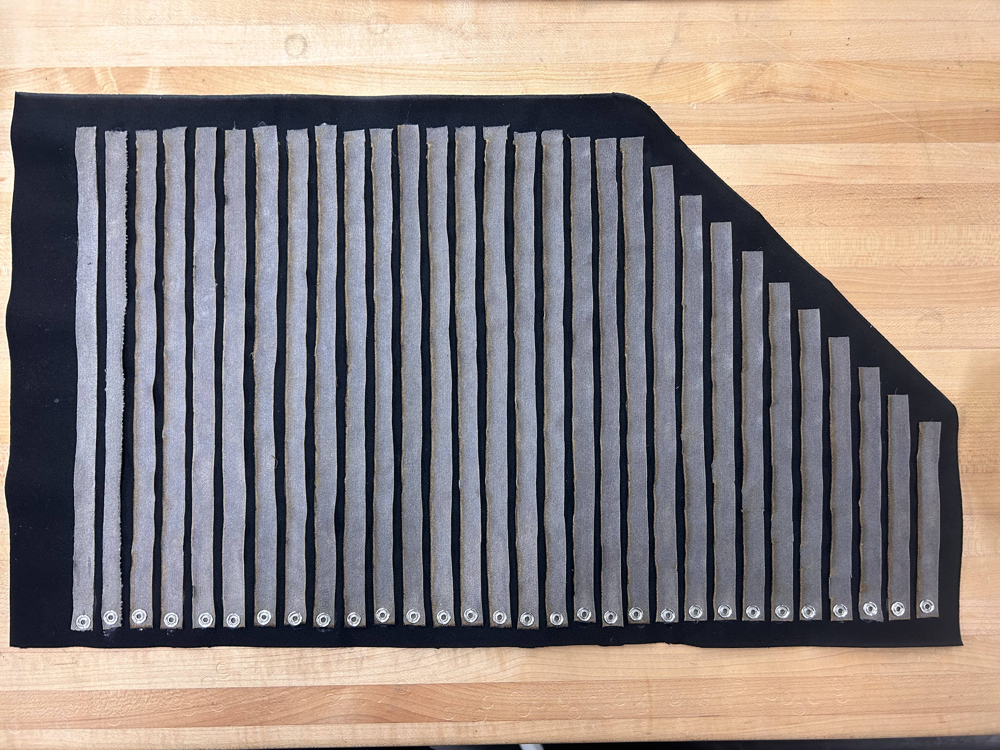

6. Solder the ribbon cable wire to the metal snaps. First, cut each individual wire so that it has a little slack to reach it's own metal snap. For the rows, where there are only 16 metal snaps, you will only need one ribbon cable. My convention is to make the single red wire the first index and increment from there, but this is not required. For the columns, where there are 64 metal snaps, you need four different ribbon cables. You can have all four start from one corner of the sensor (requires more wire and is thicker) or you can have two ribbon cables start on one end and the other two on the other end (sensor should then be wrapped around a cylindrical object so that the wires exit the sensor in a nearby physical location). I like the later option unless the sensor must be layed flat. Again, my convention is to make the red wire on the first ribbon cable the first index, the red wire on the second cable the 17th index, etc. This means that the red wire is the shortest on the first two ribbon cables and the longest on the second two ribbon cables. Make sure that the ribbon cable has some slack that sticks out past the edge of the sensor for plugging into the slave sensor board (I usually leave 18 inches of slack to not risk anything). Strip the wires and pre-tin them with a soldering iron as shown below (also shown in pretin_wires.MOV in resources directory).

    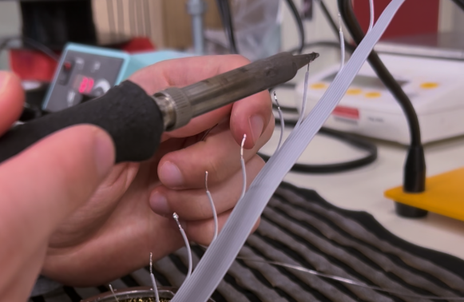

    Pretin the metal snaps as shown below and in the video pretin_snaps.MOV located in the resources directory.

    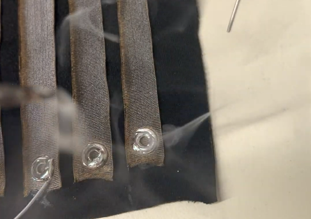

    Solder each wire to its metal snap as shown below and in solder_wires_to_snaps.MOV in the resources directory. This can be done by one person, but is easier with two people.

    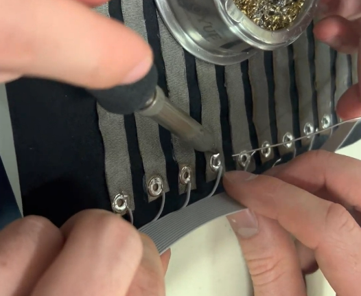

    Once done, it will look like this:

    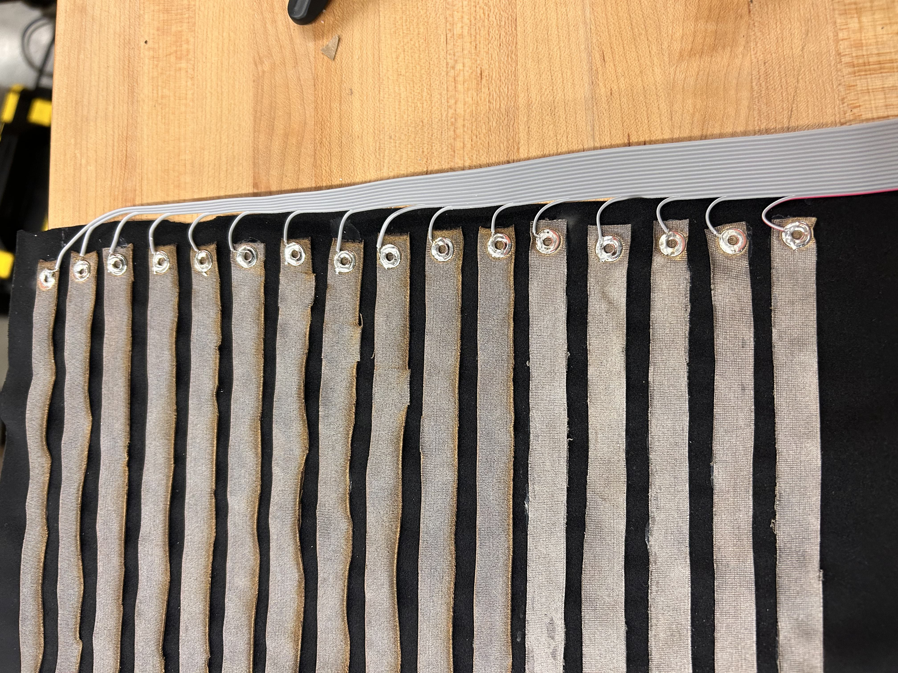

    Fold the wires over to leave the outline of spandex for glueing as shown below:

    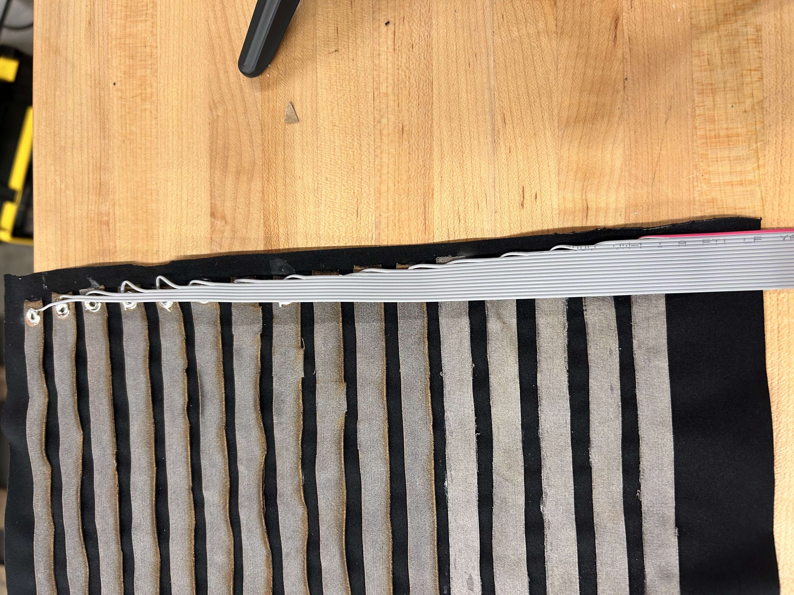

    Cut a slit in the spandex for the ribbon cable to exit so they don't come out of the exact end.

7. Dry fit the two conductive strip halves and the resisive fabric to make sure everything is the right size and in the right place. Make sure that the resistive fabric covers every place where a conductive row and column cross.

8. Glue the three layers together. First, glue the resistive fabric along it's perimeter to one of the outer spandex layers. Next glue the two spandex layers to each other using the large perimeter you left on both of them. Try to also get some glue holding the resistive fabric to the second outer spandex layer. Don't get glue between the resistive fabric and the conductive strips. Let this dry overnight with an even, heavy weight on top.

9. If needed, trim the edges of the exterior spandex so that the two sides are flush.

10. Attach the black female headers to the five ends of the ribbon cable. According to my convention, the arrow indicating the first pin should be on the red wire. A completed sensor is shown below.

    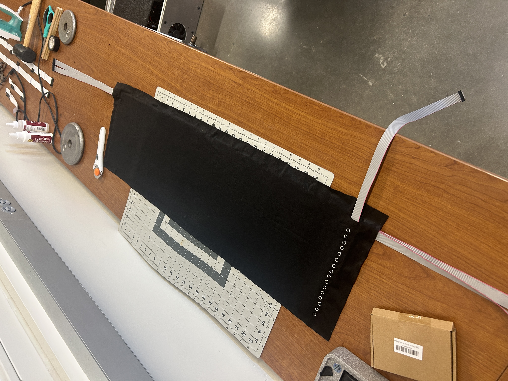

11. Plug in the sensor to the tactile sensor slave board using the five ribbon cables. The arrow on the black female headers should be aligned with the label "1" for each of the five cables. The singular row cable should plug into the slot that is orthogonal to the other four. The four column cables should be plugged into the remaining four slots. If the sensor board is oriented with the ethernet jacks at the bottom, the column cables should be inserted left to right. This is shown below:

    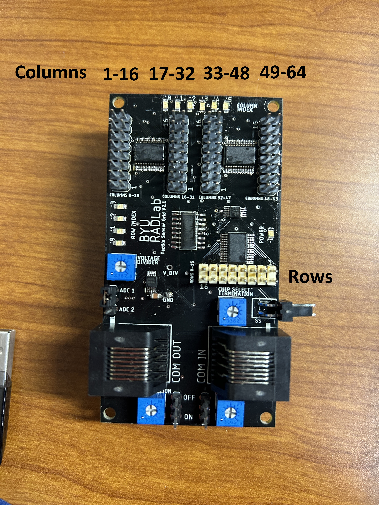

12. Test the new sensor with the setup described in the **arduino** and main directories.

---