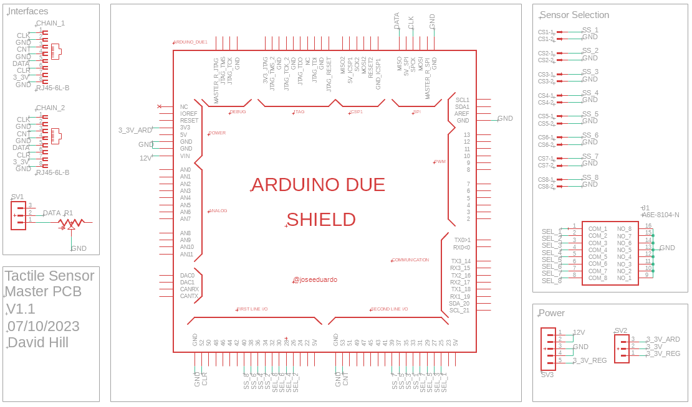
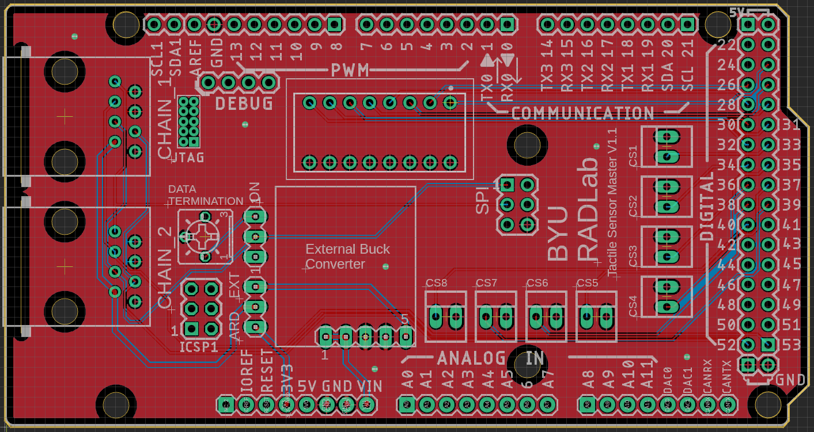
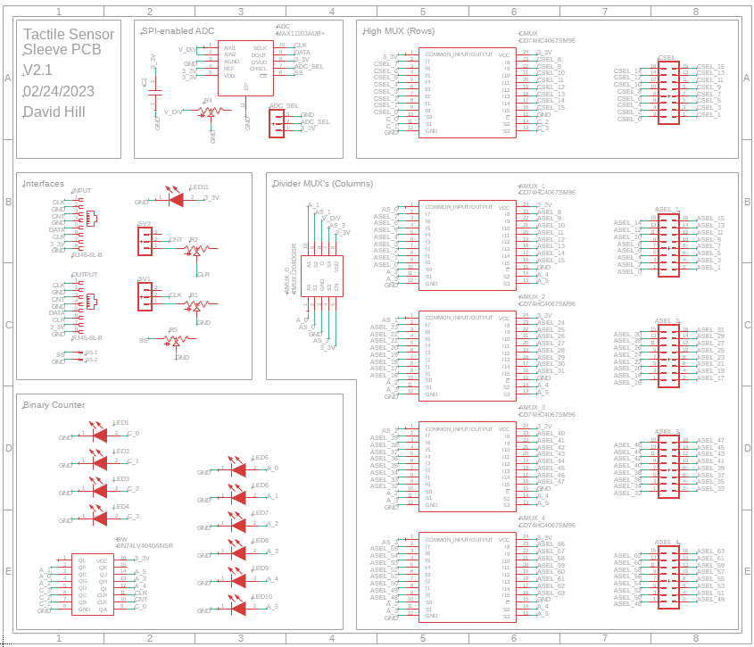
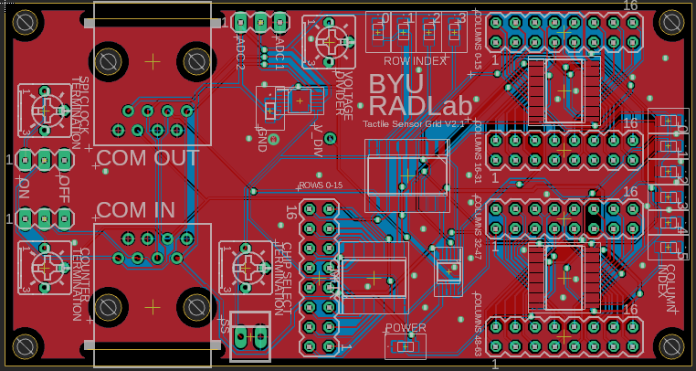
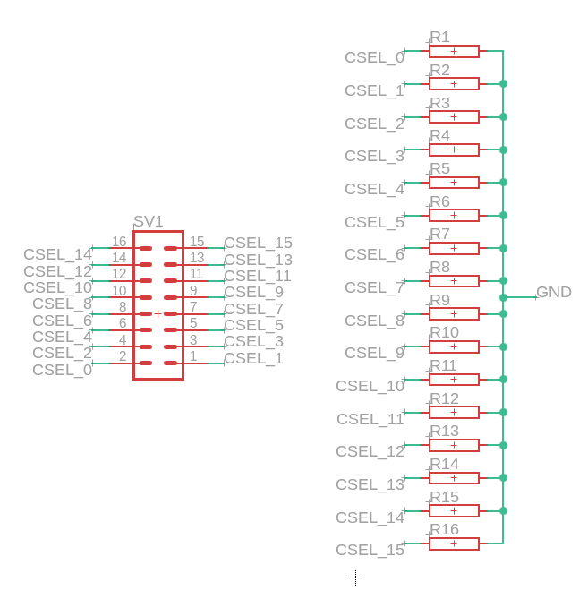
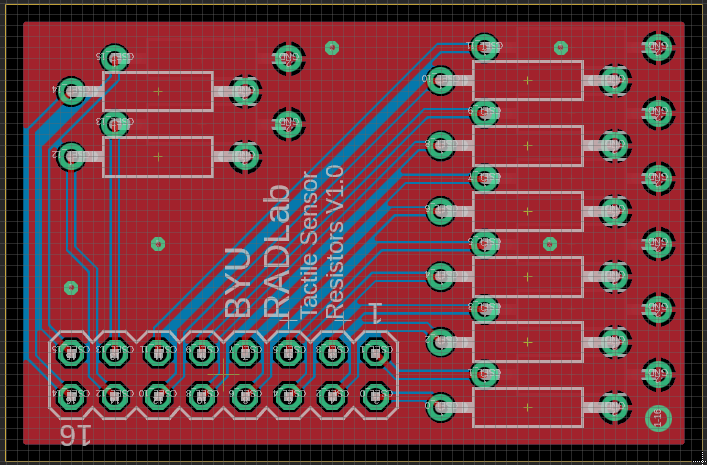

# Overview

This project was made by members of the Robotics and Dynamics Lab at Brigham Young University. This directory contains all of the necessary instructions and files for the custom PCB's we designed for reading force data from up to eight 16x64 fabric tactile sensor arrays (or a total of 8192 force readings) at up to 80sps. These boards, in combination with an Arduino Due, enable the use of ROS to read large amounts of tactile data.

These PCBs were designed using Autodesk EAGLE, then later using Fusion 360. The corresponding board, and schematic files are found in this directory, as well as the CAM outputs. These are easy enough to import into Fusion 360.

We used JLCPCB to print out PCBs.

There are three pcbs in this directory: a tactile sensor master board that is a shield for the Arduino Due, a tactile sensor slave board that is mounted next to and attached to each 16x64 sleeve sensor array, and a resistor board that is an add-on to the slave board.
To understand the design behind these PCB's, espessially the slave PCB which is the most technical, I suggest reading the Tactile_Sleeve_Notes.pdf file in the resources folder.

---
# Tactile Sensor Master Board

## Bill of Materials for each Board

| Qty |  Cost  | Device                          | Parts                                                   | Description                                 | PURCHASE_URL |
|-----|--------|---------------------------------|---------------------------------------------------------|---------------------------------------------|--------------|
| 2   | $0.10  | 3-pin Male Header               | SV1, SV2                                                | Decide termination and power source         | NA           |
| 1   | $0.20  | 5-pin Female Header             | SV3                                                     | Plug in external 3.3V buck converter        | NA          |
| NA  | $1.00  | Male Header Pins                |                                                         | Headers needed to put the shield on the due | NA          |
| 8   | $0.35  | 2-pin Male Molex Connector      | CS1, CS2, CS3, CS4, CS5, CS6, CS7, CS8                  | For CS pins                                 | [link](https://www.mouser.com/ProductDetail/Molex/171856-0002?qs=s7UCm7gO1bYKeEMrirBzyw%3D%3D)             |
| 1   | $4.95  | 8-pin Dip Switch                | J1                                                      | Dip switch for selecting sleeve to read     | [link](https://www.mouser.com/ProductDetail/Omron-Electronics/A6E-8104-N?qs=vyIerDHf/mloJqQ30NZRaQ%3D%3D)             |
| 2   | $1.00  | Ethernet port                   | CHAIN_1, CHAIN_2                                        | Used for daisy-chaining slave devices       | [link](https://www.mouser.com/ProductDetail/TE-Connectivity-AMP/5555164-4?qs=BcfjnG7NVaVPSt3aHUi1SQ%3D%3D)           |
| 1   | $1.02  | 200 Ohm Potentiometer           | R1                                                      | Used for terminating data line              | [link](https://www.mouser.com/ProductDetail/Bourns/3362P-1-201LF?qs=sGAEpiMZZMtC25l1F4XBU4KpuikCFD1JVjzxlorewD8%3D)              |
| 1   | $15.95 | External 3.3V Buck Converter    |                                                         | Powers all of the sensors                   | [link](https://www.pololu.com/product/3781)             |

The total price per board (including printing the pcb) is about $40 (parts are $28.02 and JLCPCB charges about $20 for 5 copies of the pcb, plus shipping and tax). Note that there are fairly significant bulk discounts for many of these parts. 

## Schematic

NOTE: there is a PDF version of the schematic in this directory if greater resolution is needed.

## Layout

## Setup

There are a few things that you can physically change on this board. First, the 8-channel dip switch is used to tell the arduino which sensors it should report. If the arduino due is running the tactile_sensors_reporter.ino file, it will read which switches are flipped on and only report the sensors that correspond to those switches. The slave select pins that correspond to each switch are labelled (CS1, CS2, etc.). Use a wire to connect the correct CS pin on the master to the SS pin on the slave device.

Second, there are three male header pins next to the data termination potentimeter. The data line should be terminated using the potentiometer set to 120 ohms (or a tuned value) if only one chain is being used. If both chains are being used, then the line should not be terminated.

Lastly, there is another set of three male header pins with the words EXT and ARD. This will determine if you want to power the sensors from the external buck converter or the arduino. Only power up to two sensors using the arduino. In any other case, use the external buck converter.

---
# Tactile Sensor Slave Board with Add-on Board

## Bill of Materials

| Qty | Cost  | Device                     | Parts                                                       | Description                                   | Purchase Link                                                                                                                                                                                                                                                                                                                                                                                                                                             |
|-----|-------|----------------------------|-------------------------------------------------------------|-----------------------------------------------|-----------------------------------------------------------------------------------------------------------------------------------------------------------------------------------------------------------------------------------------------------------------------------------------------------------------------------------------------------------------------------------------------------------------------------------------------------------|
| 5   | $0.89 | 16-channel Analog Mux      | CMUX, AMUX_1, AMUX_2, AMUX_3, AMUX_4                        | Multiplexers for switching between sensors    | [link](https://www.mouser.com/ProductDetail/Texas-Instruments/CD74HC4067SM96?qs=JHHQeKcAU3DyfvAOSRLjhQ%3D%3D)                                                                                                                                                                                                                                                                                                                                                                                                                                                          |
| 1   | $0.96 | 4-channel Analog Mux       | AMUX_0                                                      | Multiplexer for switching between sensors     | [link](https://www.mouser.com/ProductDetail/Texas-Instruments/TMUX1204DGSR?qs=EBDBlbfErPw42Q0DdvAwUg%3D%3D) |
| 1   | $12.76| SPI-enabled 12-bit ADC     | ADC                                                         | ADC for reading voltage divider               | [link](https://www.mouser.com/ProductDetail/Analog-Devices-Maxim-Integrated/MAX11103AUB%2b?qs=mzcOS1kGbgdW3dlgSnprJw%3D%3D) |
| 1   | $1.38 | 12-bit Binary Counter      | SW                                                          | Counter for triggering MUX's based on clock   | [link](https://www.mouser.com/ProductDetail/Texas-Instruments/SN74LV4040AD?qs=UG/8xqv/6WeL19NQ6cIFrg%3D%3D) |
| 2   | $1.00 | Ethernet port              | INPUT, OUTPUT                                               | Connection for daisy-chain                    | [link](https://www.mouser.com/ProductDetail/TE-Connectivity-AMP/5555164-4?qs=BcfjnG7NVaVPSt3aHUi1SQ%3D%3D) |
| 4   | $0.60 | 2x8-pin Male Header        | ASEL_1, ASEL_2, ASEL_3, ASEL_4                              | For plugging in fabric sensor ribbon cable    | [link](https://www.mouser.com/ProductDetail/Amphenol-FCI/67996-416HLF?qs=zDLUbuhEZ18YJlcRJvn0zg%3D%3D) |
| 1   | $1.86 | 2x8-pin Long Male Header   | CSEL                                                        | For plugging in fabric sensor ribbon cable    | [link](https://www.mouser.com/ProductDetail/Samtec/HTSW-108-10-T-D?qs=%252BZP6/%252BtExtB9K2tO%252BdFStQ%3D%3D) |
| 3   | $0.28 | SPI-enabled 12-bit ADC     | SV1, SV2, ADC_SEL                                           | Turn on termination and choose ADC channel    | [link](https://www.mouser.com/ProductDetail/Amphenol-FCI/68000-403H?qs=eanFghet1JNqC/0Iz%252BuUPw%3D%3D) |
| 3   | $1.02 | 200 Ohm Potentiometer      | R1, R2, R5                                                  | Used for terminating communication lines      | [link](https://www.mouser.com/ProductDetail/Bourns/3362P-1-201LF?qs=sGAEpiMZZMtC25l1F4XBU4KpuikCFD1JVjzxlorewD8%3D)              |
| 1   | $0.89 | 3k Ohm Potentiometer       | R4                                                          | Used as the know half of the voltage divider  | [link](https://www.mouser.com/ProductDetail/Bourns/3362P-1-302LF?qs=sGAEpiMZZMtC25l1F4XBUxCk7s1FufIVD8TlfNkTc8c%3D) |
| 1   | $0.36 | 2-pin Male Molex Connector | SS                                                          | Connection for CS on slave                    | [link](https://www.mouser.com/ProductDetail/Molex/171857-0002?qs=vOeJqewp7jDZ/eRg0MxvZQ%3D%3D) |
| 10  | $0.29 | Blue 3.3V LED              | LED1, LED2, LED3, LED4, LED5, LED6, LED7, LED8, LED9, LED10 | Used to debug clock, display current sensor   | [link](https://www.mouser.com/ProductDetail/Stanley-Electric/VCDB1112H-5AY3B-TR?qs=byeeYqUIh0NdrgXR4WHsww%3D%3D) |
| 1   | $1.99 | Green 3.3V LED             | LED11                                                       | Indicates that the board has power            | [link](https://www.mouser.com/ProductDetail/Lumex/SML-LX0805UPGC-TR?qs=nsAcsc0rFlwqqwNCsw8Xxg%3D%3D) |
| 1   | $0.67 | 10uF Capacitor             | C2                                                          | Used for input to ADC power supply            | [link](https://www.mouser.com/ProductDetail/TDK/C2012X7S1E106K125AE?qs=P1JMDcb91o5L0SBQ9NWlYQ%3D%3D) |
| 16  | $0.27 | 27 Ohm 1W Resistor         | (Add-on)                                                    | Used as pull-down resistor on rows            | [link](https://www.walmart.com/ip/Metal-Film-Resistors-27-Ohm-1W-1-Tolerances-5Color-Bands-Pack-of-30/513536791?wmlspartner=wlpa&selectedSellerId=571) |
| 1   | $2.18 | 2x8-pin Female Headers     | (Add-on)                                                    | Used to connect to main slave board           | [link](https://www.mouser.com/ProductDetail/Samtec/SSQ-108-01-T-D?qs=rU5fayqh%252BE3zRJ1c1JB7Dw%3D%3D) |

Total cost of this board with the add-on is about $55. (parts are about $43.02 and JLCPCB charges about $20 for 10 copies of each pcb, plus shipping and tax).

## Main Schematic

NOTE: there is a PDF version of the schematic in this directory if greater resolution is needed.

## Main Layout

## Add-on Schematic

## Add-on Layout

NOTE: the extra ground pin on the add-on board should be connected to the ground on the main slave board. I have usually done this by soldering a wire directly between the extra ground pin and the labelled ground via hole on the main board.

## Setup

There are a few things that you can physically change on the main slave board. First, the SPI Clock and Counter pins can be terminated with potentiometers. The termination resistors should only be enabled if the board is the last board on the daisy chain. If there are two chains, both ends should be terminated. If used, these should be set to 120 ohms or tuned until the communication channel works. 

Second, there are two ADC channels, both of which read the sensors voltage. There are three male header pins that can be used to enable either of the ADC channels. This should not matter, unless one channel is somehow broken (very unlikely).