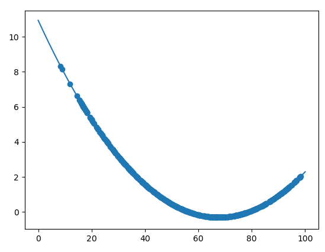
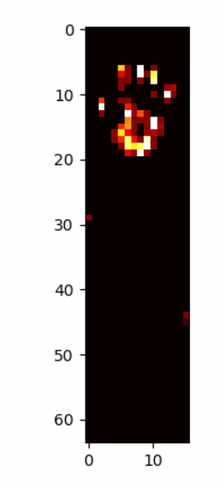

# Overview

This project was made by members of the Robotics and Dynamics Lab at Brigham Young University. This directory contains all of the necessary scripts for launching ROS nodes to read and plot data from eight 16x64 tactile sensor arrays. The data publishing is handled in a script called tactile_repeater while the plotting is handled in another called tactile_plotter. The plotting is for debuging and calibration purposes only. When the sensor is being used to inform control algorithms, only the data publishing script need run.

# Calibration

In order to calibrate a sensor, use the script calibrate.py in the calibration folder. An example of this is: "python3 calibrate.py right 0 large_1 2" where "right" and "0" define the namespace of the ROS topic that contains the tactile data, "large_1" is the sensor name that will be used in the calibration YAML file, and "2" is the order of the polynomial fit that you want to use in your calibration (1 is linear, 2 is quadratic, etc.) The calibration will start by recording the readings when there is no force applied. To start this process, push enter after it prompts "Press enter to save no-load data". This will take a few minutes, so don't touch the sensor during that time. After it is done, it will print "No-load data saved". It will then prompt you to apply a known force on the sleeve. Apply a known force and enter the force in newtons in the terminal. It will then continue to prompt you to apply different known forces. Apply these in varying places on the sleeve and in various surface areas if possible. Once there is sufficient force data to make a polynomial fit, a plot will come up with the calibration script's current best fit. It will also print the net error in the model. Once you have had a chance to look at the plot, close it and decide if you like it or if you want to add more force data points. If you decided to add more points, it will ask you how many. After all of those are inputted, it will display a new plot with the updated best fit model. Continue with this process until you are satisfied. Once you are done, it will prompt you with "Do you want to set a maximum resistance for registering a force?" This means you can make a maximum resistance that will represent a force, any resistance above this will be zero Newtons. Answer that prompt and it will save your calibration file.

# Tactile Repeater

The tactile_repeater.py file should be run on the computer directly connected to the arduino due running the tactile_sensors_reporter.ino file. This will likely by something like a Raspberry Pi or an Odroid mounted near the sensors. The tactile_repeater.py file is used in three launch scripts called tactile_repeater.launch, tactile_repeater_left.launch, and tactile_repeater_right.launch. These launch files will publish to topics in the /tactile/main, /tactile/left, and /tactile/right namespaces respectively. The latter two are for use on a humanoid robot in which two seperate odroids are used; one runs the sensors on the left half of the body while the other runs the sensors on the right half of the body. The tactile_repeater.py file will publish to a seperate topic for each sensor that it recieves data for. This is determined by which of the arduino due master board dip switches are flipped on. For example, if I run "roslaunch tactile_sensor tactile_repeater_right.launch" and the 1 and 5 switches are flipped on, the script will publish data to the /tactile/right/0 and /tactile/right/4 topics (note that they are indexed differently).

# Tactile Plotter

The tactile_plotter.py file can run from any computer with the same ROS_MASTER_URI as the computer on which the tactile repeater node is running. This file will look for data on the topic that you specify. By default, it will look for data being published on the /tactile/main/0 topic. The topic can be changed using command line arguments. For example, if I run "python3 tactile_plotter.py left 4 large_1" then it will look for data being published to /tactile/left/4, using the calibration file calibration_large_1.yaml. If there is data being published to the desired topic, the tactile plotter node will use matplotlib to plot the data as if comes in. The plot should look like the one below where a hand is pressing down on the fabric.

---